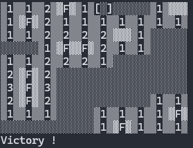

# PyMineSweeper
A minesweeper in some language (and Python, the name come from here)

>[!IMPORTANT]
>The sole purpose of this project is to provide examples that may be useful for learning purposes.
>
>And for that reason, the entire code is commented.

# Python
The first version is, of course, the Python version, available in two different versions:
## Cli
You can run the cli version by running the file `cli_code.py`.   
(Note : the script has a settings value : `color` wich is by default set at `True`, this settings allow, or not, the color mode, set it to `False if you don't want color`).

It work on Linux, MacOS and Windows.  
No lib needed.

### Without color :  

### With color :

### Key
Use the arrow to move.  
Use the spacebar to place or removed Flag.  
Use enter to mine.  
Use the q key to quit

## Ui (tkinter)
Not available yet.
