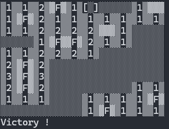
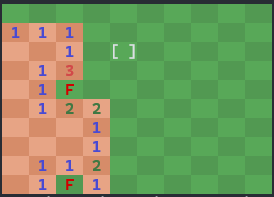
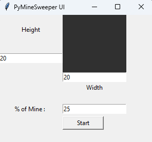
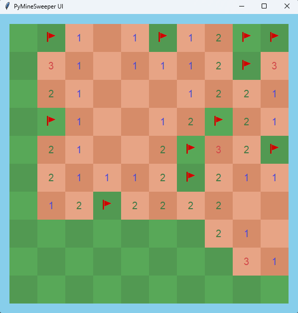

# PyMineSweeper
A minesweeper in some language (and Python, the name come from here)

>[!IMPORTANT]
>The sole purpose of this project is to provide examples that may be useful for learning purposes.
>
>And for that reason, the entire code is commented.

- [Python version](#python)
- [Lua version](#lua)
- [Javascript, HTML, CSS (web) version](#javascript)
- [Ruby version](#ruby)
- [TCL version](#tcl)
- [C version](#c)
- [TCL-TK and C version](#c)
- [Kotlin version](#kotlin)

# Python

>[!TIP]
>Python is a well know programming language loved mainly by the beginers for it's simplicity.

The first version is, of course, the Python version, available in two different versions:
## Cli
You can run the cli version by running the file `cli_code.py`.   
(Note : the script has a settings value : `color` wich is by default set at `True`, this settings allow, or not, the color mode, set it to `False if you don't want color`).

It work on Linux, MacOS and Windows.  
No lib needed.

### Without color :  

### With color :

### Key
Use the arrow to move.  
Use the spacebar to place or removed Flag.  
Use enter to mine.  
Use the q key to quit

## Ui (tkinter)
You can run the UI version by running the file `ui_code.py`.   

It work on Linux, MacOS and Windows.  
No lib needed.

### The selector

### The game

### Key
Use left click to mine.  
Use right click to place or removed Flag.  

# Javascript

>[!TIP]
>Javascript is a well know programming language.
>It's the main and default language of the web.
>JS is also used outside the browser (node) and in mobile and desktop app (react native and electron).

A web version of the game.  
You can find the js version here : [https://github.com/Jimmxyz/Minesweeper-CLI](https://github.com/Jimmxyz/Simple-Minesweeper)  
You can play it here : [https://jimmxyz.github.io/Simple-Minesweeper/](https://jimmxyz.github.io/Simple-Minesweeper/)

>[!CAUTION]
>This version is not commented and may be difficult for beginners to read.

# Kotlin

>[!TIP]
>Kotlin is an improved version of Java (do not confond with JS).
>Kotlin is multiplatform and it's the main and official language of Android.

This version is only a cli version.  
Work on Linux and MacOS (Manual Install on Windows will work).  
You can find the kotlin version here : [https://github.com/Jimmxyz/Minesweeper-CLI](https://github.com/Jimmxyz/Minesweeper-CLI)

>[!CAUTION]
>This version is not commented and may be difficult for beginners to read.

# Ruby
Not available yet.

# Lua
Not available yet.

# TCL
Not available yet.

# C
Not available yet.

# TCL-TK and C
Not available yet.
